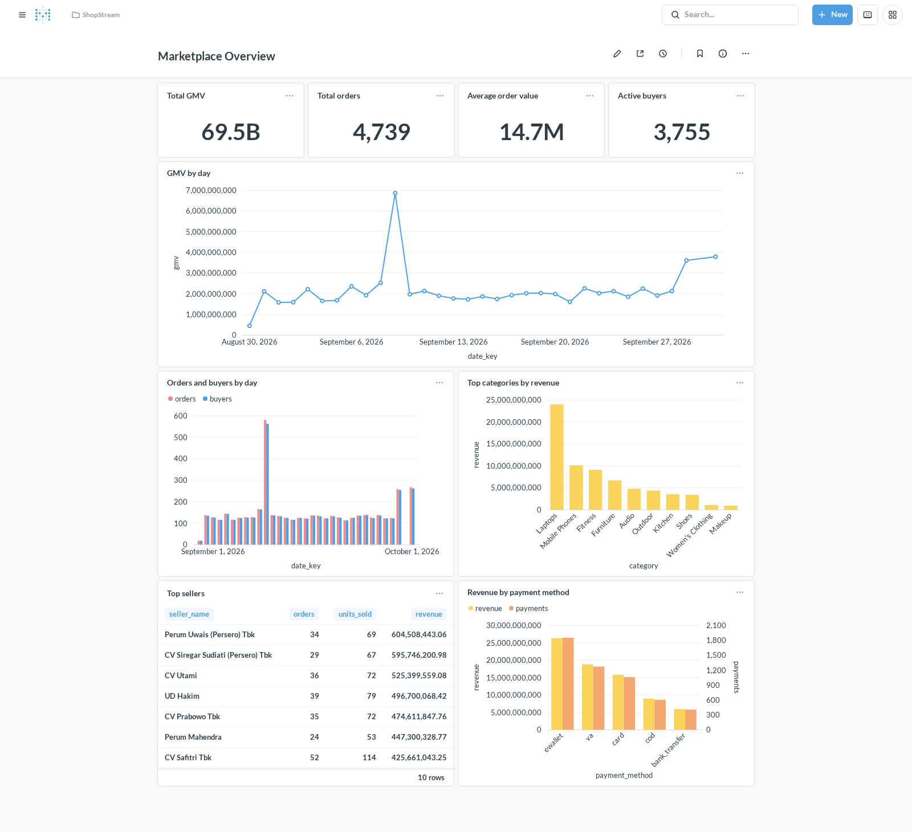
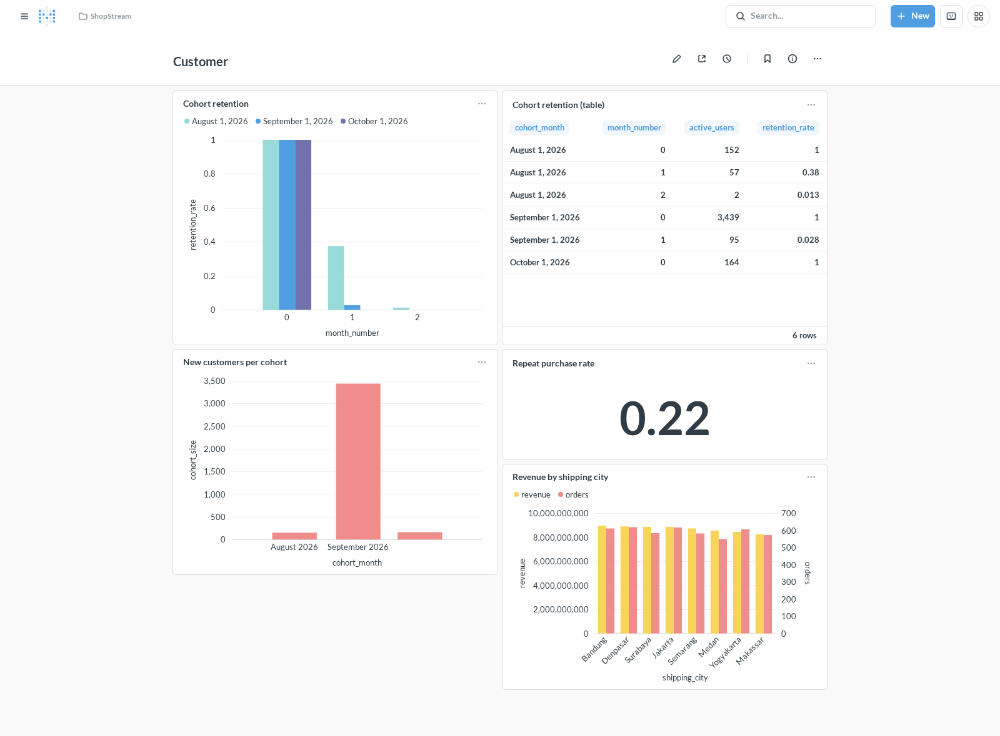
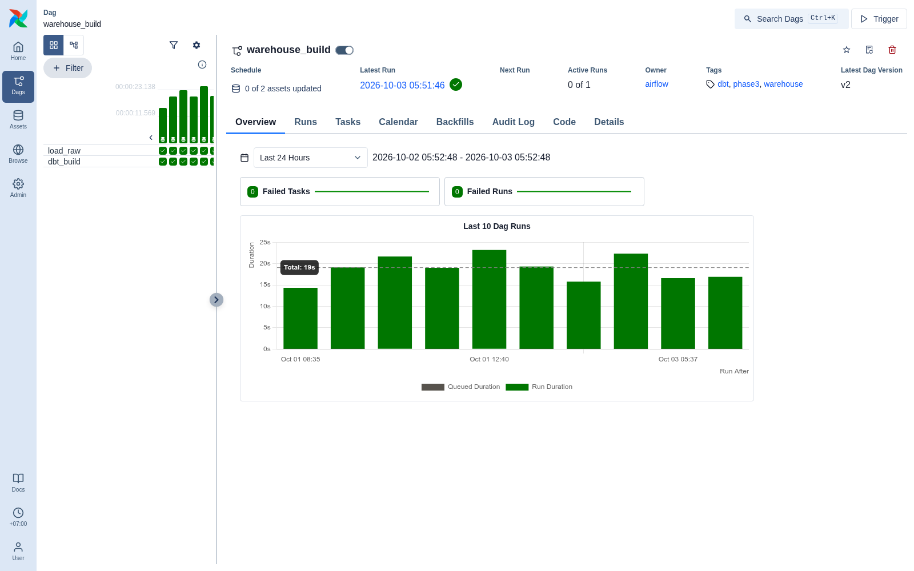
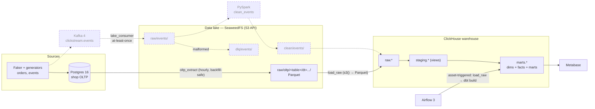
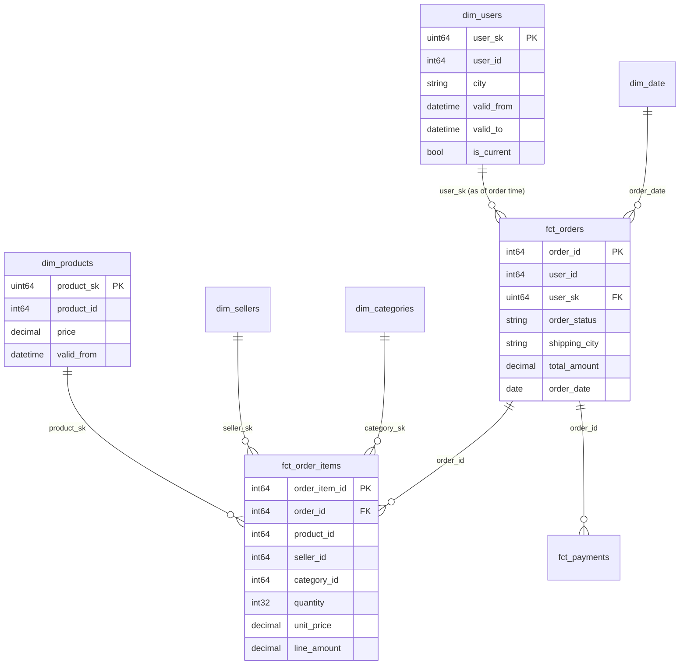

# ShopStream — a self-hosted marketplace data platform

An end-to-end data platform for a simulated Southeast Asian e-commerce marketplace,
built to run entirely on one laptop: **Postgres → S3-compatible lake → ClickHouse →
dbt → Airflow → Metabase**, with every layer containerised and reproducible from a
single `make` command.

The point of the project is the parts that are hard: **backfills that can be safely
re-run**, **duplicate and late data**, **SCD2 history**, **incremental facts**, and
**orchestration that reacts to data instead of a clock**.

> **Status:** the batch path (Phases 1–4) is complete and verified end-to-end.
> Streaming (Kafka → lake), Spark, and CI are in progress — see
> [Roadmap](#roadmap). Anything marked *planned* below is not built yet.

<!-- Screenshots --------------------------------------------------------- -->

## What it looks like

`mart_daily_gmv`, `mart_seller_performance` and friends, in Metabase — the spike is
the 9.9 flash-sale day the generators simulate:



Cohort retention and customer behaviour, including a repeat-purchase rate and
revenue by shipping city:



Airflow 3 runs the pipeline on a **data asset**, not a schedule — the
`warehouse_build` DAG is triggered whenever `oltp_extract` lands new Parquet:



## At a glance

| | |
|---|---|
| dbt | 18 models (7 staging, 5 dimensions, 3 incremental facts, 3 marts) + 2 SCD2 snapshots |
| Data quality | **96 dbt data tests** (incl. custom reconciliation + SCD2 integrity) and **35 pytest tests** |
| Warehouse | ClickHouse 26.3: `raw` (ReplacingMergeTree) → `staging` (views) → `marts` |
| Orchestration | Airflow 3.3 (LocalExecutor), asset-triggered; hourly extract with catchup |
| Verified | Backfills are idempotent; re-running `dbt build` does not duplicate fact rows |
| Stack | Postgres 16 · Kafka 4 · SeaweedFS (S3) · PySpark · ClickHouse · dbt 1.12 · Airflow 3 · Metabase |
| Runs on | ~8 GB RAM via Compose profiles and per-service memory limits |

## Architecture

Solid arrows are implemented; dashed arrows are planned.



## Simulated data, on purpose

The source data is generated, and the messiness is deliberate — a clean dataset would
exercise none of the machinery above:

| Imperfection | Produced by | Rate |
|---|---|---|
| duplicate `event_id`, delivered twice | `event_generator` | ~2% |
| late events (`event_time` up to 2h back) | `event_generator` | ~3% |
| schema v2: `device` → `device_type` + `platform_version` | `event_generator` | from `--schema-v2-start` |
| malformed JSON / missing fields | `event_generator` → dead-letter (Phase 5) | ~0.5% |
| orders stalled mid-lifecycle | `seed`, `order_generator` | — |
| price drift, stock decrements, users changing city | `order_generator` | — |

Order and event timestamps follow an evening-peaked daily curve with a 5× spike on
the 9.9 / 11.11 / 12.12 flash-sale days (`Asia/Jakarta`) — that is what produces the
spike visible in the GMV chart above. Generators take `--rate`, `--duration`,
`--seed` and `--dry-run`, so runs are reproducible and testable without any services.

## Why each tool

| Layer | Tool | Why not the obvious alternative |
|---|---|---|
| App database | Postgres 16 | It is the *source* — a transactional OLTP system with FKs and constraints. Deliberately separate from the warehouse, and the extractor has to reconcile the two. |
| Warehouse | ClickHouse | Columnar, built for analytical scans and wide aggregations. Postgres would be the wrong shape for `GROUP BY` over millions of rows, which is precisely why both exist. |
| Transformation | dbt | Tests, docs, lineage, snapshots and `ref()`-based dependency management as version-controlled SQL. The modelling is the point of the project. |
| Orchestration | Airflow 3 | Real retries, backfills, catchup windows and — with assets — data-driven triggering rather than a wall-clock guess. |
| Lake | SeaweedFS | An S3-compatible API locally with zero cost, so the code is written against `s3()` and S3 URIs and only the endpoint changes for real AWS. |
| Streaming | Kafka 4 (KRaft) | Replayable log, consumer groups, and at-least-once delivery semantics to design around. No ZooKeeper. |
| BI | Metabase | A real BI tool with a first-class ClickHouse driver, and an API that makes the dashboards *provisionable from code*. |
| Processing | PySpark | Planned for the raw→clean event path, where schema merging and dedup over files is genuinely its job. |

## Data model

A star schema. `dim_users` and `dim_products` are SCD2; facts are incremental.



Dimensions: `dim_users` (SCD2) · `dim_products` (SCD2) · `dim_sellers` (SCD1) ·
`dim_categories` · `dim_date`.
Facts: `fct_orders` · `fct_order_items` · `fct_payments` (all incremental).
Marts: `mart_daily_gmv` · `mart_cohort_retention` · `mart_seller_performance`.

## Quick start

Requirements: Docker with Compose v2, [uv](https://docs.astral.sh/uv/), GNU make.
Roughly 8 GB of RAM — services are split into Compose profiles so you only run what
you need.

```bash
make env            # create .env from .env.example, then replace the change_me values
make install        # Python tooling + pre-commit hooks
make up-core        # postgres + seaweedfs (S3) + clickhouse
make seed           # Faker: 10k users, 500 sellers, 5k products, 30 days of orders
make extract        # Postgres -> Parquet in the lake
make load-raw       # lake Parquet -> ClickHouse raw tables
make dbt-build      # dbt: snapshots, staging, dims, facts, marts, 96 tests
make up-orch        # Airflow at http://localhost:8080
make up-bi          # Metabase at http://localhost:3000
make metabase-setup # provision the connection + dashboards from code
```

| Service | URL |
|---|---|
| Airflow | `http://localhost:8080` |
| Metabase | `http://localhost:3000` |
| ClickHouse | `http://localhost:8123` |
| S3 (SeaweedFS) | `http://localhost:8333` |
| Postgres | `localhost:5432` |
| Kafka | `localhost:9094` |

Development:

```bash
make lint     # ruff + sqlfluff
make test     # pytest
make check    # lint + test
```

## Design decisions worth defending

**Backfills are idempotent by construction.** Every extract writes to a key derived
from its own window —
`raw/oltp/<table>/dt=YYYY-MM-DD/<window-start>-<window-end>.parquet` — so re-running
an interval overwrites that object instead of appending a duplicate. Verified by
running a 3-day hourly backfill (73 Airflow runs) twice and confirming the lake was
byte-identical afterwards.

**Duplicates are resolved by the newest `updated_at`, not by hoping.** Raw tables are
`ReplacingMergeTree(updated_at)` keyed by the business key, because a row updated
after its interval legitimately appears in several files. Staging applies the same
rule explicitly with `FINAL`. Loading the same data twice doubles the *physical* rows
and leaves `FINAL` unchanged — which is the whole point of the engine choice.

**SCD2 builds forward, and that limitation is handled.** The raw layer keeps only the
newest version of a row, so price and city history cannot be reconstructed before the
first snapshot run. Point-in-time correctness does not depend on it: `orders.
shipping_city` and `order_items.unit_price` are snapshots taken at transaction time,
and `fct_orders.user_sk` uses an as-of join onto `dim_users` with a fallback to the
current version.

**Facts are incremental with a deliberate lookback.** Facts use
`delete+insert` on the business key with a one-day overlap, so a late change is
picked up without duplicating rows. Re-running `dbt build` leaves row counts
unchanged.

**Delivery guarantees are chosen, not inherited.** The streaming path (Phase 5) is
at-least-once with offsets committed only after the S3 write succeeds, and
downstream dedup by `event_id` — because exactly-once across Kafka and object storage
is a fiction that usually costs correctness.

**The pipeline is triggered by data.** `oltp_extract` declares an Airflow asset and
`warehouse_build` is scheduled on it, so the warehouse rebuilds when the lake
changes rather than an hour later on a cron.

## Results

Real numbers from the running stack (internal consistency is enforced by tests):

| Metric | Value |
|---|---|
| Source rows extracted | 38,847 across 7 tables |
| Orders / order lines / payments | 5,506 / 13,860 / 5,506 |
| GMV (revenue-generating orders) | 69.5 B IDR |
| Average order value | 14.7 M IDR |
| Active buyers | 3,755 |
| Repeat purchase rate | 0.22 |
| SCD2 versions captured | 10,073 users · 5,915 products (73 city moves, 915 product changes) |
| `dbt build` | **116 nodes, 0 errors** |
| Airflow | 73-run hourly backfill, asset-triggered warehouse rebuilds, ~1.4 s per run |

## Testing

- **35 pytest tests** — traffic curves, event/order factories, generator loops, Arrow
  schema mapping, lake layout, and a live backfill idempotency check.
- **96 dbt data tests** — `unique`, `not_null`, `relationships`, `accepted_values`,
  plus custom checks that generic tests cannot express:
  - every order's stored total equals the sum of its lines
  - revenue computed from `fct_orders` equals revenue from `fct_order_items`
  - each SCD2 dimension has exactly one current row per business key
  - cohort grain and retention bounds (month 0 must be 1.0, never above 1)
  - no column names leaked a table alias (a real ClickHouse footgun — see below)

## Notes for anyone reading the SQL

ClickHouse behaviours that cost real debugging time, each now pinned by a test or a
config comment:

1. **`join_use_nulls` defaults to `0`.** An unmatched `LEFT JOIN` yields `0`, not
   `NULL`, which silently defeats `coalesce(right_side, fallback)` — this put 108
   orders against user `0` until the profile set `join_use_nulls=1`.
2. **Un-aliased joined columns get alias-qualified names.** `select o.user_id` can
   create a column literally named `o.user_id`. Every mart column is explicitly
   aliased, and a test fails the build if one slips through.
3. **A read-only Metabase user needs `readonly = 2`, not `1`.** `readonly=1` forbids
   changing *settings*, and the driver sets `async_insert` on connect — so the "more
   secure" value simply does not connect.
4. **An empty interval must not write an empty Parquet object.** ClickHouse's Parquet
   reader rejects row groups with zero rows, so the extractor skips zero-row windows
   entirely (runs are still recorded in `pipeline_meta.extract_run`).

### Airflow 3 in containers

Three settings that are easy to get wrong, all set in `docker-compose.yml`:

- `AIRFLOW__SCHEDULER__CREATE_CRON_DATA_INTERVALS=true` — Airflow 3 otherwise gives
  cron DAGs a zero-width data interval, so `data_interval_start == data_interval_end`
  and an hourly extract silently extracts nothing.
- `AIRFLOW__CORE__EXECUTION_API_SERVER_URL` — tasks call an execution API that
  defaults to `localhost:8080`, which is the wrong container once components are split.
- The repo is mounted **read-only** and `.env` is deliberately **not** mounted into
  containers; config arrives only through Compose `environment`. DBT artefacts are
  redirected to `/tmp` for the same reason.

### Configuration precedence

`make` exports `.env` and the Python entry points load it with `override=True`, so
this project's `.env` wins over variables already exported in your shell — other
projects on a dev machine commonly export `POSTGRES_*` and would otherwise hijack
the connection.

## Repository layout

```
generators/        Faker seeding, order + clickstream generators, traffic curves
ingestion/         lake helpers, incremental OLTP extractor
warehouse/         ClickHouse client + lake→raw loader
dbt/shopstream/    staging → dimensions/facts → marts, snapshots, 96 tests
airflow/dags/      oltp_extract (asset producer), warehouse_build (asset consumer)
clickhouse/init/   raw table DDL
metabase/          dashboard definitions + reproducible provisioning
postgres/init/     source schema + pipeline metadata
scripts/           screenshot capture
tests/             pytest suite
docs/img/          screenshots referenced by this README
```

## Roadmap

- [x] **Phase 0** — Compose stack, pinned images, memory limits, tooling
- [x] **Phase 1** — Postgres schema, Faker data, order + event generators
- [x] **Phase 2** — S3 lake, idempotent incremental extract, Airflow orchestration
- [x] **Phase 3** — ClickHouse raw layer, dbt star schema, SCD2, 96 tests
- [x] **Phase 4** — Metabase dashboards, provisioned from code
- [ ] **Phase 5** — Kafka → lake consumer (at-least-once, dead-letter), `fct_events`,
      the acquisition funnel mart, and the ClickHouse Kafka engine for a live panel
- [ ] **Phase 6** — PySpark `clean_events`: dedup by `event_id`, merge schema v1/v2,
      partition by event time, reprocess a lookback window for late data
- [ ] **Phase 7** — Data-quality monitoring: source↔warehouse row counts, failure
      alerts, a pipeline-health panel
- [ ] **Phase 8** — CI (ruff, sqlfluff, pytest, `dbt build` in a service container)
- [ ] **Phase 9** — Full README/demo polish and a walkthrough video

## Limitations

- **`load_raw` re-reads every lake object every run.** Correct but O(history); the fix
  is to load only objects newer than a watermark, which `pipeline_meta.extract_run`
  already records.
- **The funnel mart and `fct_events` need Phase 5.** They are marked *planned* above
  rather than faked.
- **No CI yet**, so nothing enforces the test suite on push.
- **Simulated data.** The distributions, category tree and imperfections are
  deliberate, not sampled from a real marketplace — chosen because a static public
  dataset cannot produce the late, duplicated and schema-evolving data the pipeline
  is designed to handle.
- **Single-node, single-broker, single-shard.** This is a laptop-scale design;
  ClickHouse replication, Kafka replication factor > 1 and Spark on a cluster are out
  of scope.

## License

MIT — see [LICENSE](LICENSE).
