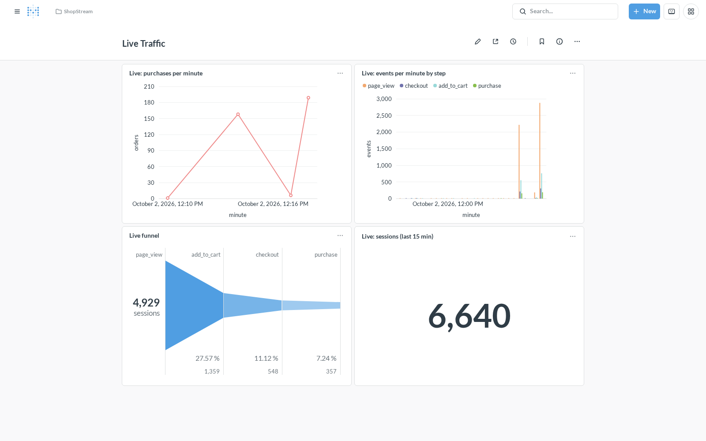
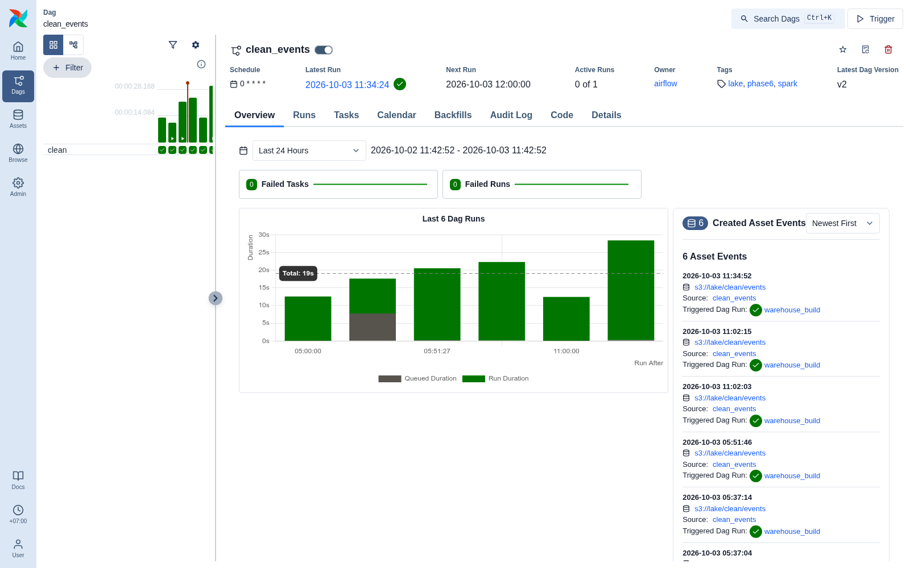
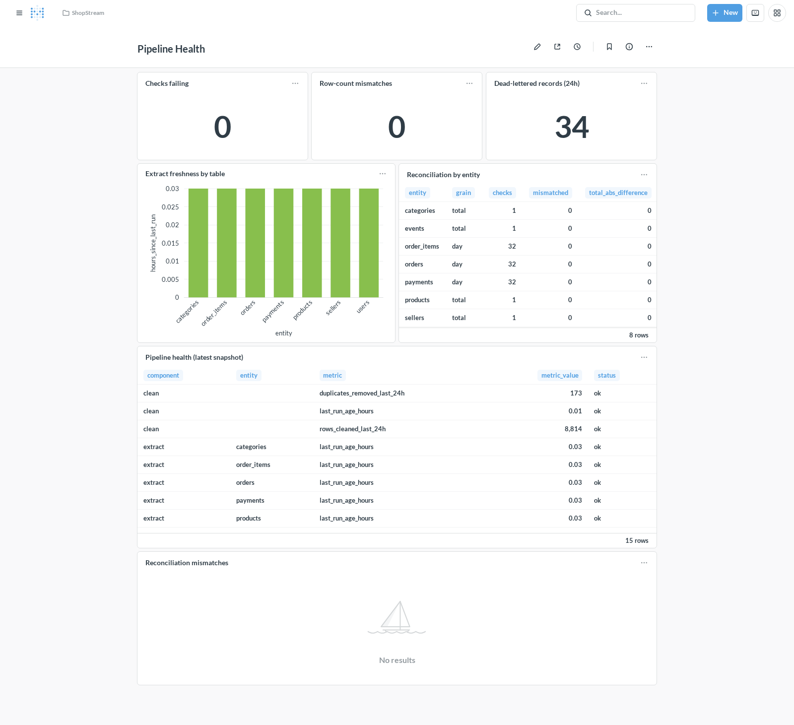
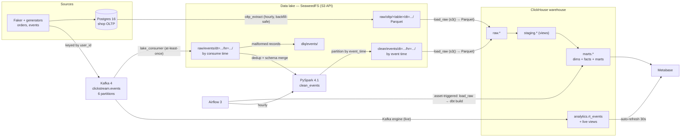
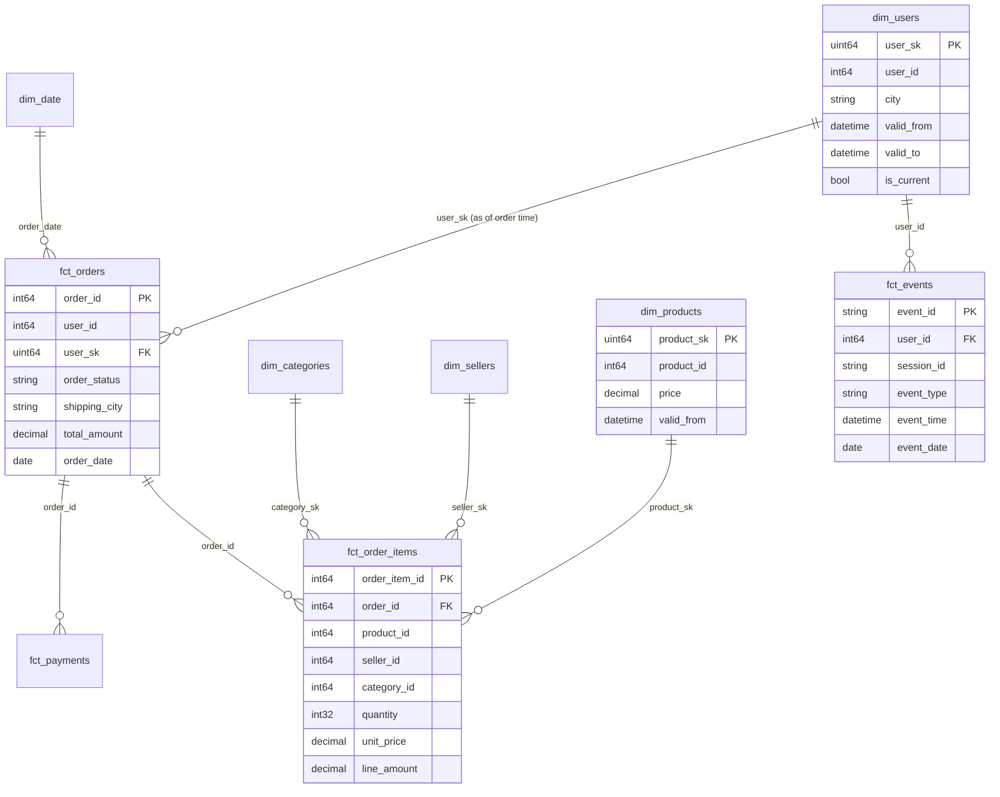

# ShopStream — a self-hosted marketplace data platform

[](https://github.com/marknshoot/data-pipeline/actions/workflows/ci.yml)

An end-to-end data platform for a simulated Southeast Asian e-commerce marketplace,
built to run entirely on one laptop: **Postgres → S3-compatible lake → ClickHouse →
dbt → Airflow → Metabase**, with every layer containerised and reproducible from a
single `make` command.

The point of the project is the parts that are hard: **backfills that can be safely
re-run**, **duplicate and late data**, **SCD2 history**, **incremental facts**,
**at-least-once streaming**, and **orchestration that reacts to data instead of a
clock**.

> **Status:** Phases 1–8 are complete and verified end-to-end — including a
> kill-the-consumer-mid-flight durability test, the Spark clean layer, row-count
> reconciliation verified by injecting a fault, and CI on every push.
> Presentation polish is in progress — see [Roadmap](#roadmap).

<!-- Screenshots --------------------------------------------------------- -->

## What it looks like

`mart_daily_gmv`, `mart_seller_performance` and friends, in Metabase — the spike is
the 9.9 flash-sale day the generators simulate:


Cohort retention, customer behaviour and the acquisition funnel built from
clickstream events:


The streaming panel reads ClickHouse's own Kafka consumption, so it moves as events
arrive rather than waiting for the hourly batch — it auto-refreshes every 30 seconds:



Airflow 3 runs the batch pipeline on a **data asset**, not a schedule — the
`warehouse_build` DAG is triggered whenever `oltp_extract` lands new Parquet:


The Spark clean job runs hourly and publishes its own asset, which is what triggers
the warehouse rebuild — neither DAG names the other:



An hourly `data_quality` DAG reconciles the source against the warehouse and writes a
health snapshot. It was verified by deleting a day of orders from the warehouse and
watching it fail:



## At a glance

| | |
|---|---|
| dbt | 22 models (7 staging, 5 dimensions, 4 facts, 3 marts) + 2 SCD2 snapshots |
| Data quality | **125 dbt data tests** (incl. custom reconciliation, SCD2 and funnel integrity) and **107 pytest tests** |
| Warehouse | ClickHouse 26.3: `raw` (ReplacingMergeTree) → `staging` (views) → `marts` |
| Streaming | Kafka 4 (6 partitions, keyed by `user_id`) → lake via an at-least-once consumer, plus a ClickHouse Kafka-engine path for the live panel |
| Processing | PySpark 4.1 clean layer: dedup by `event_id`, merge schema v1/v2, partition by event time, and a lookback that *replaces* partitions rather than appending |
| Orchestration | Airflow 3.3 (LocalExecutor), asset-triggered in both directions; hourly extract and hourly clean with catchup |
| Monitoring | Hourly `data_quality` DAG: dbt source freshness, **101 source↔warehouse row-count checks**, a health snapshot for the dashboard, and an `on_failure_callback` that logs and optionally posts to a webhook |
| CI | Four GitHub Actions jobs: lint, pytest, Spark tests, and a real `dbt build` against a ClickHouse service container |
| Verified | Backfills and fact rebuilds are idempotent; `SIGKILL`ing the consumer mid-batch loses no events; a rerun replaces a clean partition instead of duplicating it |
| Stack | Postgres 16 · Kafka 4 · SeaweedFS (S3) · PySpark · ClickHouse · dbt 1.12 · Airflow 3 · Metabase |
| Runs on | ~8 GB RAM via Compose profiles and per-service memory limits |

## Architecture

Every arrow below is implemented.



## Simulated data, on purpose

The source data is generated, and the messiness is deliberate — a clean dataset would
exercise none of the machinery above:

| Imperfection | Produced by | Rate |
|---|---|---|
| duplicate `event_id`, delivered twice | `event_generator` | ~2% |
| late events (`event_time` up to 2h back) | `event_generator` | ~3% |
| schema v2: `device` → `device_type` + `platform_version` | `event_generator` | from `--schema-v2-start` |
| malformed JSON / missing fields | `event_generator` → `dlq/events/` | ~0.5% |
| orders stalled mid-lifecycle | `seed`, `order_generator` | — |
| price drift, stock decrements, users changing city | `order_generator` | — |

Order and event timestamps follow an evening-peaked daily curve with a 5× spike on
the 9.9 / 11.11 / 12.12 flash-sale days (`Asia/Jakarta`) — that is what produces the
spike visible in the GMV chart above. Generators take `--rate`, `--duration`,
`--seed` and `--dry-run`, so runs are reproducible and testable without any services.

## Why each tool

| Layer | Tool | Why not the obvious alternative |
|---|---|---|
| App database | Postgres 16 | It is the *source* — a transactional OLTP system with FKs and constraints. Deliberately separate from the warehouse, and the extractor has to reconcile the two. |
| Warehouse | ClickHouse | Columnar, built for analytical scans and wide aggregations. Postgres would be the wrong shape for `GROUP BY` over millions of rows, which is precisely why both exist. |
| Transformation | dbt | Tests, docs, lineage, snapshots and `ref()`-based dependency management as version-controlled SQL. The modelling is the point of the project. |
| Orchestration | Airflow 3 | Real retries, backfills, catchup windows and — with assets — data-driven triggering rather than a wall-clock guess. |
| Lake | SeaweedFS | An S3-compatible API locally with zero cost, so the code is written against `s3()` and S3 URIs and only the endpoint changes for real AWS. |
| Streaming | Kafka 4 (KRaft) | Replayable log, consumer groups, and at-least-once delivery semantics to design around. No ZooKeeper. |
| BI | Metabase | A real BI tool with a first-class ClickHouse driver, and an API that makes the dashboards *provisionable from code*. |
| Processing | PySpark | Planned for the raw→clean event path, where schema merging and dedup over files is genuinely its job. |

## Data model

A star schema. `dim_users` and `dim_products` are SCD2; facts are incremental.



Dimensions: `dim_users` (SCD2) · `dim_products` (SCD2) · `dim_sellers` (SCD1) ·
`dim_categories` · `dim_date`.
Facts: `fct_orders` · `fct_order_items` · `fct_payments` · `fct_events` (all
incremental).
Marts: `mart_daily_gmv` · `mart_cohort_retention` · `mart_seller_performance` ·
`mart_funnel_daily` · `mart_funnel_steps`.

## Quick start

Requirements: Docker with Compose v2, [uv](https://docs.astral.sh/uv/), GNU make.
Roughly 8 GB of RAM — services are split into Compose profiles so you only run what
you need.

```bash
make env            # create .env from .env.example, then replace the change_me values
make install        # Python tooling + pre-commit hooks
make up-core        # postgres + seaweedfs (S3) + clickhouse
make seed           # Faker: 10k users, 500 sellers, 5k products, 30 days of orders
make extract        # Postgres -> Parquet in the lake
make load-raw       # lake Parquet -> ClickHouse raw tables
make dbt-build      # dbt: snapshots, staging, dims, facts, marts, 125 tests
make up-orch        # Airflow at http://localhost:8080
make up-bi          # Metabase at http://localhost:3000
make metabase-setup # provision the connection + dashboards from code
```

The streaming path (needs `make up-stream`):

```bash
make up-stream      # kafka (KRaft) + create the 6-partition topic
make gen-events     # publish clickstream: duplicates, late and malformed records
make consume-events # Kafka -> lake, at-least-once, dead-lettering bad payloads
make load-raw       # now also loads raw.events (skipped when the lake is empty)
make kafka-engine   # ClickHouse Kafka engine + the live per-minute views
make kafka-engine ARGS="--verify"   # check the live path and its consumers
```

The Spark clean layer (the container provides the JVM, so the host needs none):

```bash
make spark-clean               # clean the last 3 hours into clean/events
make spark-clean ARGS="--full" # first run: every raw partition
make spark-test                # the Spark job's tests, run in the container
```

| Service | URL |
|---|---|
| Airflow | `http://localhost:8080` |
| Metabase | `http://localhost:3000` |
| ClickHouse | `http://localhost:8123` |
| S3 (SeaweedFS) | `http://localhost:8333` |
| Postgres | `localhost:5432` |
| Kafka | `localhost:9094` |

Development:

```bash
make lint     # ruff + sqlfluff
make test     # pytest
make check    # lint + test
make ci-dbt   # rehearse CI's dbt job on a throwaway ClickHouse (Docker required)
```

## Design decisions worth defending

**Backfills are idempotent by construction.** Every extract writes to a key derived
from its own window —
`raw/oltp/<table>/dt=YYYY-MM-DD/<window-start>-<window-end>.parquet` — so re-running
an interval overwrites that object instead of appending a duplicate. Verified by
running a 3-day hourly backfill (73 Airflow runs) twice and confirming the lake was
byte-identical afterwards.

**Duplicates are resolved by the newest `updated_at`, not by hoping.** Raw tables are
`ReplacingMergeTree(updated_at)` keyed by the business key, because a row updated
after its interval legitimately appears in several files. Staging applies the same
rule explicitly with `FINAL`. Loading the same data twice doubles the *physical* rows
and leaves `FINAL` unchanged — which is the whole point of the engine choice.

**SCD2 builds forward, and that limitation is handled.** The raw layer keeps only the
newest version of a row, so price and city history cannot be reconstructed before the
first snapshot run. Point-in-time correctness does not depend on it: `orders.
shipping_city` and `order_items.unit_price` are snapshots taken at transaction time,
and `fct_orders.user_sk` uses an as-of join onto `dim_users` with a fallback to the
current version.

**Facts are incremental with a deliberate lookback.** Facts use
`delete+insert` on the business key with a one-day overlap, so a late change is
picked up without duplicating rows. Re-running `dbt build` leaves row counts
unchanged.

**Delivery guarantees are chosen, not inherited.** The streaming path is
at-least-once: offsets are committed only *after* the S3 write succeeds, with
`enable.auto.offset.store` off so the client can never commit data it has not
persisted. Redelivery is therefore possible, which is why `raw.events` is a
`ReplacingMergeTree` keyed by `event_id` — and why that is cheaper than pretending
exactly-once across Kafka and object storage is achievable. Verified by `SIGKILL`ing
the consumer mid-batch: the kill left partition 0 with a lag of 295 uncommitted
records, and the restart consumed exactly those 295.

**Late events get a lookback window.** The generator sends ~3% of events up to two
hours behind, so `fct_events` re-reads a three-hour window on every incremental run
and `delete+insert`s on `event_id`. A late event lands in the hour it *belongs* to,
not the hour it arrived in.

**The Spark layer replaces partitions, it does not append to them.** A run reprocesses
the last three whole hours and deletes each affected `dt=/hr=` prefix before writing
it. Appending would be simpler and wrong: a rerun that produced fewer rows would leave
the previous run's files in place and quietly double-count. The window also starts on
an hour boundary, so the oldest partition it touches is rebuilt from all of its events
rather than a partial hour — and because an event cannot be consumed before it
happens, selecting raw objects by their *path* is enough to guarantee the window is
complete. The job refuses to run with a lookback shorter than the producer's maximum
lateness, because that combination can silently drop a late event.

**The live panel is event-grain, not a pre-aggregated counter.** ClickHouse's Kafka
engine is also at-least-once, so a `SummingMergeTree` minute counter double-counts on
rebalance — measured, not theorised: 11,427 events from 8,724 messages. Keying the
live table on `event_id` and aggregating on read makes redelivery idempotent, and the
numbers reconcile exactly with the topic.

**The pipeline is triggered by data.** `oltp_extract` declares an Airflow asset and
`warehouse_build` is scheduled on it, so the warehouse rebuilds when the lake
changes rather than an hour later on a cron.

**Row-count checks are bounded by the extract watermark.** The warehouse only holds
what has been extracted, so comparing it against *all* of Postgres would report a
difference every time somebody placed an order since the last extract. Each check
filters the source to rows created before that table's last extract window end.
Without that bound the check is noise; with it, any non-zero difference is a real
defect — which is what makes it safe to fail a task on one.

**Quality checks do not gate the build.** A stale source does not mean the last build
was wrong, and blocking the build on freshness would stop the warehouse refreshing
exactly when it is behind. The checks live in their own DAG, so they raise the alarm
without withholding data.

## Results

Real numbers from the running stack (internal consistency is enforced by tests):

| Metric | Value |
|---|---|
| Source rows extracted | 38,847 across 7 tables |
| Orders / order lines / payments | 5,506 / 13,860 / 5,506 |
| GMV (revenue-generating orders) | 69.5 B IDR |
| Average order value | 14.7 M IDR |
| Active buyers | 3,755 |
| Repeat purchase rate | 0.22 |
| SCD2 versions captured | 10,073 users · 5,915 products (73 city moves, 915 product changes) |
| Clickstream | 5,995 topic messages → 5,854 distinct events (25 dead-lettered, 116 duplicate copies collapsed) |
| Spark clean layer | 5,970 raw rows → 5,854 out (116 duplicate deliveries removed), 3 event-time partitions, ~12 s |
| Acquisition funnel | 4,113 sessions → 1,098 cart → 427 checkout → 292 purchase |
| `dbt build` | **149 nodes, 0 errors** |
| Reconciliation | **101 checks, 0 mismatches** (7 source tables per day or whole-table, plus the lake vs `raw.events`) |
| Airflow | 73-run hourly backfill, asset-triggered warehouse rebuilds, ~1.4 s per run |
| Durability | `SIGKILL` mid-batch → 0 events lost; the restart resumed at exactly the uncommitted offset |
| Fault injection | deleting 339 orders for one day → the check reported `source=339 warehouse=0 diff=+339` and the DAG failed; repairing with dbt turned it green again |

## Continuous integration

Four jobs on every push and pull request (`.github/workflows/ci.yml`):

| Job | What it proves |
|---|---|
| `lint` | ruff (lint + format) and sqlfluff over `clickhouse/` |
| `test` | 111 pytest tests — no services required; the two that talk to Postgres skip themselves when it is absent |
| `spark` | 15 Spark tests on Temurin 17, with pyspark pulled in as an optional dependency group |
| `dbt` | applies the warehouse DDL to a ClickHouse service container, seeds a small fixture, and runs the real `dbt build` — 149 nodes, 125 data tests |

The `dbt` job is the interesting one. The full pipeline needs Postgres, Kafka,
SeaweedFS and a JVM, which is far too much for a runner, so
`ci/seed_sample_data.py` loads a fixture directly into `raw.*` that satisfies every
test's invariant: order totals are computed from their line items, the funnel narrows
at every step, one user orders in two months so cohort retention has a real month-1
row, and both event schema versions are present.

A fixture that cannot fail a test proves nothing, so its properties are asserted
independently in `tests/test_ci_fixtures.py` — and the schema application is checked
for statements that would be sent to ClickHouse empty.

Rehearse the whole job locally without touching the dev warehouse:

```bash
make ci-dbt   # throwaway ClickHouse on :18123, then DDL + seed + dbt build
```

## Testing

- **111 pytest tests** (no JVM needed) — traffic curves, event/order factories,
  generator loops, Arrow schema mapping, lake layout, a live backfill idempotency
  check, the consumer's delivery contract with fakes (a fake consumer records every
  `commit`; a failing sink must produce *no* commit), the row-count comparison logic,
  the failure callback's awkward paths — no webhook configured, webhook unreachable,
  a bare Airflow context, a broken formatter — and the CI fixture's own invariants.
- **15 Spark tests** (`make spark-test`, inside the container) — a local SparkSession
  over a lake faked with pyarrow's local filesystem, so the job's real code path runs:
  the v1/v2 schema merge, dedup keeping the newest delivery, event-time partition
  formatting, window selection, and that a rerun *replaces* a partition rather than
  appending to it. They also caught a real bug — `run()` listed objects with one
  filesystem and downloaded them with another.
- **125 dbt data tests** — `unique`, `not_null`, `relationships`, `accepted_values`,
  plus custom checks that generic tests cannot express:
  - every order's stored total equals the sum of its lines
  - revenue computed from `fct_orders` equals revenue from `fct_order_items`
  - each SCD2 dimension has exactly one current row per business key
  - cohort grain and retention bounds (month 0 must be 1.0, never above 1)
  - the funnel never widens, overall or on any single day, and its rates stay in [0, 1]
  - no column names leaked a table alias (a real ClickHouse footgun — see below)

### The row-count check has teeth

A check that has never failed is not evidence of anything, so the reconciliation was
tested by breaking the pipeline on purpose:

| | |
|---|---|
| Healthy | `data_quality` succeeds; 101 checks, 0 mismatches |
| Inject a fault | `ALTER TABLE marts.fct_orders DELETE WHERE order_date = <one day>` |
| Detected | `MISMATCH orders 2026-10-01 source=339 warehouse=0 diff=+339`, DAG fails, `[ALERT] data_quality.reconcile failed -- RuntimeError: row-count reconciliation found a mismatch` |
| Repair | `dbt build --select fct_orders` → the next run succeeds |

### The streaming durability test

`SIGKILL` the consumer while a batch is in flight, restart the same consumer group,
and check the lake against the topic:

```bash
# 5,995 messages on the topic, 25 of them deliberately malformed,
# 116 of them duplicate copies of an existing event_id
EXPECTED_DISTINCT=5854
```

| | |
|---|---|
| Before the kill | 19 batches committed; partition 0 left with a lag of 295 |
| After the restart | consumed exactly 295 records (292 valid + 3 malformed) |
| Lake result | 5,970 rows written, **5,854 distinct `event_id`s**, 25 dead-lettered |
| Verdict | no events lost; redelivery cost 116 duplicate rows, removed by `event_id` |

## Notes for anyone reading the SQL

ClickHouse behaviours that cost real debugging time, each now pinned by a test or a
config comment:

1. **`join_use_nulls` defaults to `0`.** An unmatched `LEFT JOIN` yields `0`, not
   `NULL`, which silently defeats `coalesce(right_side, fallback)` — this put 108
   orders against user `0` until the profile set `join_use_nulls=1`.
2. **Un-aliased joined columns get alias-qualified names.** `select o.user_id` can
   create a column literally named `o.user_id`. Every mart column is explicitly
   aliased, and a test fails the build if one slips through.
3. **A read-only Metabase user needs `readonly = 2`, not `1`.** `readonly=1` forbids
   changing *settings*, and the driver sets `async_insert` on connect — so the "more
   secure" value simply does not connect.
4. **An empty interval must not write an empty Parquet object.** ClickHouse's Parquet
   reader rejects row groups with zero rows, so the extractor skips zero-row windows
   entirely (runs are still recorded in `pipeline_meta.extract_run`).
5. **A missing lake prefix is not an error.** `list_keys` returns `[]` rather than
   raising, so `load_raw` reports `events  skipped (no objects in the lake)` on a
   fresh clone instead of crashing.

### Kafka engine

6. **`kafka_auto_offset_reset` no longer exists.** ClickHouse 26.3 removed the
   setting, so a fresh consumer group replays the topic before going live.
7. **Drop the target table too.** The provisioning is DROP-then-CREATE; forgetting to
   drop the `SummingMergeTree` target failed *after* dropping the materialized view,
   leaving the live path half-built. Order is view → MV → source → target.
8. **`KAFKA_LOG_DIRS` must match the mounted volume.** The image writes to
   `$KAFKA_HOME/logs` by default, so a volume mounted at `/var/lib/kafka/data` is
   decorative: every `docker compose up` that recreated the container silently wiped
   every topic. Caught by recreating the container and watching the topic disappear.

### Spark and the lake

9. **pyarrow's `LocalFileSystem` rejects absolute paths.** The Spark tests fake the
   lake with it, so the fake bucket is relative and the test changes directory. That
   constraint is what surfaced a real bug: the job listed objects with one filesystem
   and downloaded them with another, so it worked against real S3 and failed against
   the fake.
10. **`LocalExecutor` runs tasks inside the scheduler container**, so the scheduler's
   memory limit has to fit a Spark driver, not just the scheduler. A real deployment
   would submit to a cluster with `SparkSubmitOperator` instead of sharing a container.
11. **A Nullable column cannot be in a MergeTree sorting key** unless
   `allow_nullable_key` is enabled. `dq_row_counts.check_date` is nullable (whole-table
   checks have no date), so it is deliberately left out of `ORDER BY`.
12. **`value` is a SQL keyword.** The health table's column is `metric_value`;
   sqlfluff's `RF04` catches it, and so would a reader.
13. **A semicolon inside a `--` comment splits a naive SQL file splitter.**
   `00_databases.sql`'s header says "dbt builds staging/marts later; raw is loaded from
   the lake", which cut the first `CREATE DATABASE` in half and sent ClickHouse an
   empty query. `split_statements` now drops line comments before splitting, and a test
   asserts no DDL file yields a comment-only statement.

### Airflow 3 in containers

Three settings that are easy to get wrong, all set in `docker-compose.yml`:

- `AIRFLOW__SCHEDULER__CREATE_CRON_DATA_INTERVALS=true` — Airflow 3 otherwise gives
  cron DAGs a zero-width data interval, so `data_interval_start == data_interval_end`
  and an hourly extract silently extracts nothing.
- `AIRFLOW__CORE__EXECUTION_API_SERVER_URL` — tasks call an execution API that
  defaults to `localhost:8080`, which is the wrong container once components are split.
- The repo is mounted **read-only** and `.env` is deliberately **not** mounted into
  containers; config arrives only through Compose `environment`. DBT artefacts are
  redirected to `/tmp` for the same reason.

### Configuration precedence

`make` exports `.env` and the Python entry points load it with `override=True`, so
this project's `.env` wins over variables already exported in your shell — other
projects on a dev machine commonly export `POSTGRES_*` and would otherwise hijack
the connection.

## Repository layout

```
generators/        Faker seeding, order + clickstream generators, traffic curves
ingestion/         lake helpers, incremental OLTP extractor
streaming/         Kafka -> lake consumer (at-least-once) + ClickHouse Kafka engine
monitoring/        Source-vs-warehouse row counts + the pipeline health snapshot
spark/             PySpark clean layer: dedup, schema merge, event-time partitioning
warehouse/         ClickHouse client + lake→raw loader
dbt/shopstream/    staging → dimensions/facts → marts, snapshots, 125 tests
airflow/dags/      oltp_extract, warehouse_build, clean_events, data_quality
ci/                the CI fixture, its seeding and the schema application
clickhouse/init/   warehouse DDL (raw tables, events, quality tables)
metabase/          dashboard definitions + reproducible provisioning
postgres/init/     source schema + pipeline metadata
scripts/           screenshot capture
tests/             pytest suite
docs/img/          screenshots referenced by this README
.github/workflows/ CI: lint, pytest, Spark tests, dbt build
```

## Roadmap

- [x] **Phase 0** — Compose stack, pinned images, memory limits, tooling
- [x] **Phase 1** — Postgres schema, Faker data, order + event generators
- [x] **Phase 2** — S3 lake, idempotent incremental extract, Airflow orchestration
- [x] **Phase 3** — ClickHouse raw layer, dbt star schema, SCD2, 96 tests
- [x] **Phase 4** — Metabase dashboards, provisioned from code
- [x] **Phase 5** — Kafka → lake consumer (at-least-once, dead-letter), `fct_events`,
      the acquisition funnel, the ClickHouse Kafka engine, and the live panel
- [x] **Phase 6** — PySpark `clean_events`: dedup by `event_id`, merge schema v1/v2,
      partition by event time, reprocess a lookback window and replace those
      partitions; hourly DAG publishing an asset that triggers the warehouse rebuild
- [x] **Phase 7** — Data-quality monitoring: 101 source↔warehouse row-count checks
      bounded by the extract watermark, dbt source freshness as a task, a
      `data_quality` DAG, an `on_failure_callback` that logs and optionally posts to a
      webhook, and a Pipeline Health panel
- [x] **Phase 8** — CI: GitHub Actions running ruff, sqlfluff, pytest, the Spark tests
      and a real `dbt build` against a ClickHouse service container on a purpose-built
      fixture; pre-commit hooks were already in place from Phase 0. The optional AWS
      Terraform module was deliberately not built (see Limitations)
- [ ] **Phase 9** — Full README/demo polish and a walkthrough video

## Limitations

- **`load_raw` re-reads every lake object every run.** Correct but O(history); the fix
  is to load only objects newer than a watermark, which `pipeline_meta.extract_run`
  already records.
- **The funnel counts sessions per step, not strictly ordered journeys.** A session
  that added to cart without a page view still counts at the cart step. That is a
  deliberate choice — the alternative hides the inconsistency instead of failing the
  monotonicity test.
- **No CI yet**, so nothing enforces the test suite on push.
- **No Terraform module.** The plan listed an optional AWS S3 + least-privilege IAM
  module; it is skipped on purpose, because a portfolio repo that asks a reviewer to
  trust an untested `apply` is worse than one that says it is out of scope. The lake
  code is already endpoint-driven, so switching to real S3 is a config change.
- **The freshness checks fail when the producers are stopped.** That is the intended
  behaviour — a stale pipeline should be visible — but it means the `data_quality` DAG
  is red on an idle laptop until you run the stream, the extract and the clean job.
- **Spark runs inside the Airflow container.** Fine at this scale, but a real
  deployment submits to a cluster and does not put a driver in the scheduler's
  container.
- **Spark reads the lake through pyarrow rather than `s3a`.** Adding `hadoop-aws` and
  the AWS SDK means a few hundred megabytes of jars to move a handful of small files,
  so the transfer stays in the Python lake client the extractor and loader already
  use. On a cluster, `fs.s3a.*` would be the right choice.
- **The clean layer re-reads raw objects from the window's start onward** — the same
  O(history) shape as `load_raw`, bounded by the lookback rather than fixed properly
  with a manifest of what has already been published.
- **Simulated data.** The distributions, category tree and imperfections are
  deliberate, not sampled from a real marketplace — chosen because a static public
  dataset cannot produce the late, duplicated and schema-evolving data the pipeline
  is designed to handle.
- **Single-node, single-broker, single-shard.** This is a laptop-scale design;
  ClickHouse replication, Kafka replication factor > 1 and Spark on a cluster are out
  of scope. The consumer's at-least-once guarantee is exercised, but broker failover
  is not.

## License

MIT — see [LICENSE](LICENSE).
